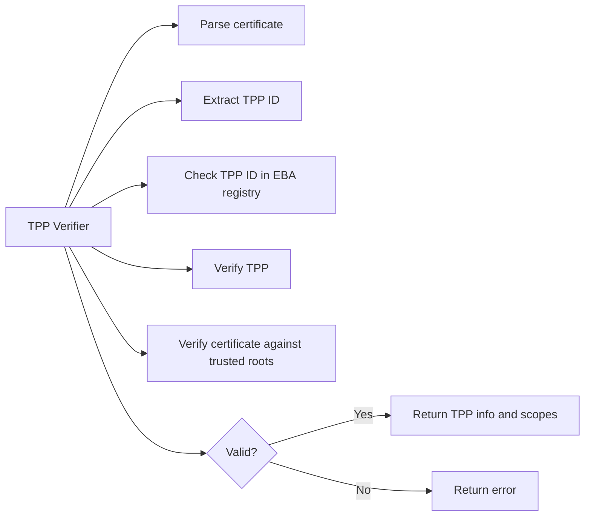

# TPP Verifier

### Open Banking TPP verifier API description

# How it works
Implements verification and validation of Open Banking Third Party Providers (TPPs). 
It verifies and validates PSD2 QWAC and QSealC certificates by:
1. Parsing the provided certificate.
2. Extracting the TPP ID from the certificate's organization identifier.
3. Checking the TPP ID against the EBA registry to confirm its validity.
4. Verifying the certificate against a set of trusted root certificates.
5. Returning the TPP information and scopes.

### TPP Verification Process


# Example request
The API exposes a single endpoint `/verify` which accepts a POST request with a JSON body containing a base64-encoded certificate.
```bash
curl -X POST http://localhost:8080/tpp/verify \
    "cert": "-----BEGIN CERTIFICATE-----....-----END CERTIFICATE-----"
}'
```

# Example response
```json
{
    "cert": {
        "expired": false,
        "scopes": [
            "PIS",
            "AIS"
        ],
        "serial_number": "166265749521381119151001480319330331692166129915",
        "issuer": {
            "common_name": "myintermediate.example.com"
        },
        "subject": {
            "common_name": "domain.com",
            "country": [
                "FI"
            ],
            "locality": [
                "HELSINKI"
            ],
            "organization": [
                "Some Company Name"
            ],
            "organization_identifier": "PSDFIN-FINFSA-1234567-8",
            "serial_number": "12345678"
        },
        "not_before": "2025-08-17 10:13:53 +0000 UTC",
        "not_after": "2035-08-15 10:13:53 +0000 UTC",
        "usage": "QSEAL"
    },
    "tpp": {
        "id": "PSDFIN-FINFSA-12345678",
        "name_latin": "Test TPP",
        "name_native": "Teszt TPP",
        "authority": "Test Authority",
        "services": {
            "FI": [
                "AIS",
                "PIS"
            ]
        }
    },
    "valid": true,
    "scopes": {
        "FI": [
            "AIS",
            "PIS"
        ]
    }
}
```

# Deployment
Deployment consists of running the main server, which does all the verification work and a database to store the results.

Refer to the `docker-compose.yml` file for an example of how to deploy the application.

The database is used to store a list of trusted certificates and TPPs.
The database needs to be initialized with the CA bundle and EBA registry data. The tools provided in the `tools` directory can be used to populate the database:

# Disclaimer

This software is provided "as is", without warranty of any kind, express or implied, including but not limited to the warranties of merchantability, fitness for a particular purpose, and noninfringement. In no event shall the authors or copyright holders be liable for any claim, damages, or other liability, whether in an action of contract, tort, or otherwise, arising from, out of, or in connection with the software or the use or other dealings in the software.
