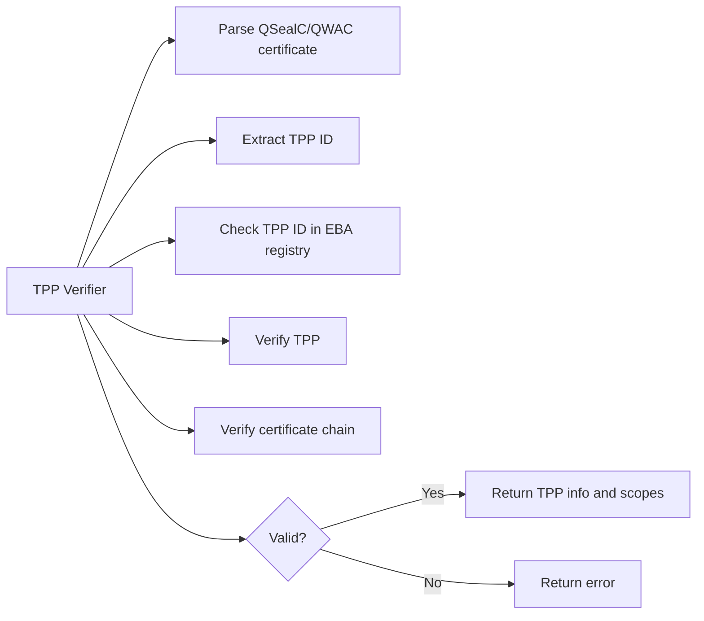

# TPP Verifier: Open Banking TPP (Third Party Provider) Certificate Validation API

## Certificate Verification

**TPP Verifier** is an open-source API for automated verification and validation of Third Party Providers (TPPs) in the context of Open Banking and PSD2. It supports the validation of QSealC and QWAC certificates, ensuring compliance with regulatory requirements and secure financial data exchange.

This project is designed for banks, fintechs, and service providers who need to verify TPPs and their certificates against the EBA (European Banking Authority) registry and trusted root CAs.


---

## Features
- **Open Banking TPP (Third Party Provider) verification**
- **PSD2 compliance**: Validates QSealC and QWAC certificates
- **EBA registry integration**: Checks TPP IDs against the official registry
- **Certificate chain validation**: Verifies against trusted root CAs
- **REST API**: Simple endpoint for certificate verification
- **Supports both QSealC and QWAC**

---

## How it works
The TPP Verifier API implements a multi-step process to ensure the authenticity and validity of TPPs and their certificates:
1. **Parsing** the provided QSealC or QWAC certificate
2. **Extracting** the TPP ID from the certificate's organization identifier
3. **Checking** the TPP ID against the EBA registry
4. **Verifying** the certificate chain against trusted root certificates
5. **Returning** TPP information, scopes, and certificate status


### TPP Verification Process



---

## Example API Request
The API exposes a single endpoint `/tpp/verify` which accepts a POST request with a JSON body containing a base64-encoded QSealC or QWAC certificate.
```bash
curl -X POST http://localhost:8080/tpp/verify \
    -H "Content-Type: application/json" \
    -d '{
        "cert": "-----BEGIN CERTIFICATE-----....-----END CERTIFICATE-----"
}'
```


## Example API Response
```json
{
    "cert": {
        "expired": false,
        "scopes": ["PIS", "AIS"],
        "serial_number": "166265749521381119151001480319330331692166129915",
        "issuer": {"common_name": "myintermediate.example.com"},
        "subject": {
            "common_name": "domain.com",
            "country": ["FI"],
            "locality": ["HELSINKI"],
            "organization": ["Some Company Name"],
            "organization_identifier": "PSDFIN-FINFSA-1234567-8",
            "serial_number": "12345678"
        },
        "not_before": "2025-08-17 10:13:53 +0000 UTC",
        "not_after": "2035-08-15 10:13:53 +0000 UTC",
        "usage": "QSEAL"
    },
    "tpp": {
        "id": "PSDFIN-FINFSA-12345678",
        "name_latin": "Test TPP",
        "name_native": "Teszt TPP",
        "authority": "Test Authority",
        "services": {"FI": ["AIS", "PIS"]}
    },
    "valid": true,
    "scopes": {"FI": ["AIS", "PIS"]}
}
```

---

## Deployment
Deployment consists of running the main server (which performs all TPP and certificate verification) and a database to store trusted certificates and TPPs.

Refer to the `docker-compose.yml` file for an example deployment.

The database must be initialized with the CA bundle and EBA registry data. Use the tools in the `tools` directory to populate the database.

---

## Disclaimer

This software is provided "as is", without warranty of any kind, express or implied, including but not limited to the warranties of merchantability, fitness for a particular purpose, and noninfringement. In no event shall the authors or copyright holders be liable for any claim, damages, or other liability, whether in an action of contract, tort, or otherwise, arising from, out of, or in connection with the software or the use or other dealings in the software.
